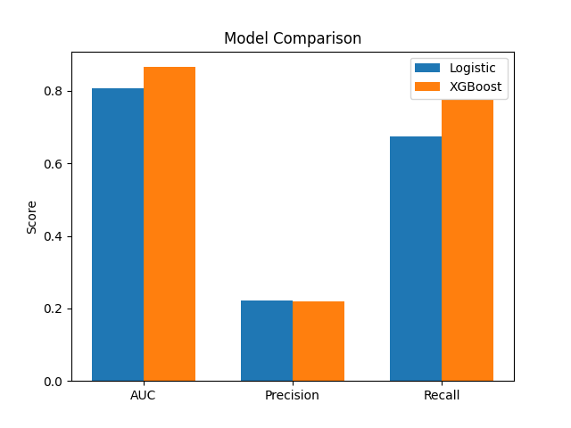

# Loan Default Predication

## Overview
This project focuses on predicting the probability of loan default using machine learning techniques. The goal is to identify high-risk customers based on financial and behavioral features.


## Dataset
The dataset is based on the Give Me Some Credit challenge on Kaggle and contains information as follows:
- Age
- Monthly Income
- Debt Ratio
- Number of past due payments
- Credit utilization

## Data Preprocessing
- Handled missing values using median imputation
- Removed invalid entries (e.g., age <= 0)


## Feature Engineering
- Created `TotalPastDue` feature combining delinquency counts
- Created `DebtToIncome` ratio
- Created `AnyPastDue` to check whether any due payments have been done
- Handled class imbalance using weighting techniques


## Models Used
- Logistic Regression (baseline)
- XGBoost (final model)


## Evaluation Strategy
- 5-Fold Stratified Cross-Validation
- Metrics used:
  - AUC 
  - Precision
  - Recall


## Results

| Model               | AUC   | Precision | Recall |
|--------------------|-------|----------|--------|
| Logistic Regression | 0.81  | 0.22     | 0.67   |
| XGBoost             | 0.87  | 0.22     | 0.77   |


## Final Model
XGBoost was selected as the final model due to higher AUC and better recall for identifying high-risk customers.


## Project Structure
project/
  - data/
  - notebooks/
  - submission/
  - README.md
  - requirements.txt

## Model Comparison


## How to Run

1. Clone the repository
2. Install dependencies
3. Run the notebook:
```bash
jupyter notebook notebooks/loan-default-prediction.ipynb
